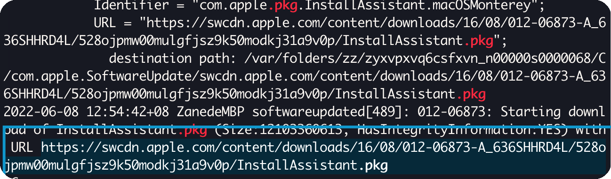

# macOS在终端恢复的教程

## 找到系统安装文件的url

1 终端执行命令 拦截下载请求

```bash
tail -f /var/log/install.log | grep .pkg
```

2 进入App Store 下载macOS系统,

复制拦截到的url  
macOS12:  
<https://swcdn.apple.com/content/downloads/18/44/012-51693-A_2W745BUZP7/xtd63whw506llesta7af6cjvcxlyj8mxvf/InstallAssistant.pkg>
macOS13:  
<https://swcdn.apple.com/content/downloads/38/13/012-20267-A_8II0GZVCTD/vsifpgvw3a3xjgyznf6415vin9xv7a6ws5/InstallAssistant.pkg>  
注意 ：上述链接生成于2022年6月8日，建议使用自己拦截到的地址。

## 进入恢复模式后

在终端中输入 resetpassword，回车
点击重置密码窗口，然后选择恢复助手—抹掉 Mac
在打开的窗口中点击抹掉 Mac，然后再次确认。完成后，Mac 会自动重启
之后输入命令

```bash
cd '/Volumes/Untitled'  #此处的Untitled需要替换为自己的硬盘名 例如Macintosh HD
mkdir -p private/tmp  # 创建private/tmp这个文件夹
cp -R '/Install macOS *** .app' private/tmp # 目的是为了将现有的安装程序拷贝到新的文件夹下
cd 'private/tmp/Install macOS.app' # 进入到软件目录
mkdir Contents/SharedSupport    # 创建新的一个文件夹
curl -L -o Contents/SharedSupport/SharedSupport.dmg + 上面的连接 # 通过curl命令将下载的pkg文件写入到dmg文件中，
```

这时，Mac 会开始下载  macOS，完成后，输入下方命令：

```bash
./Contents/MacOS/InstallAssistant_springboard # 直接通过安装面板进行安装
```

当 macOS安装器打开时，可以跟随指令重新安装 macOS
